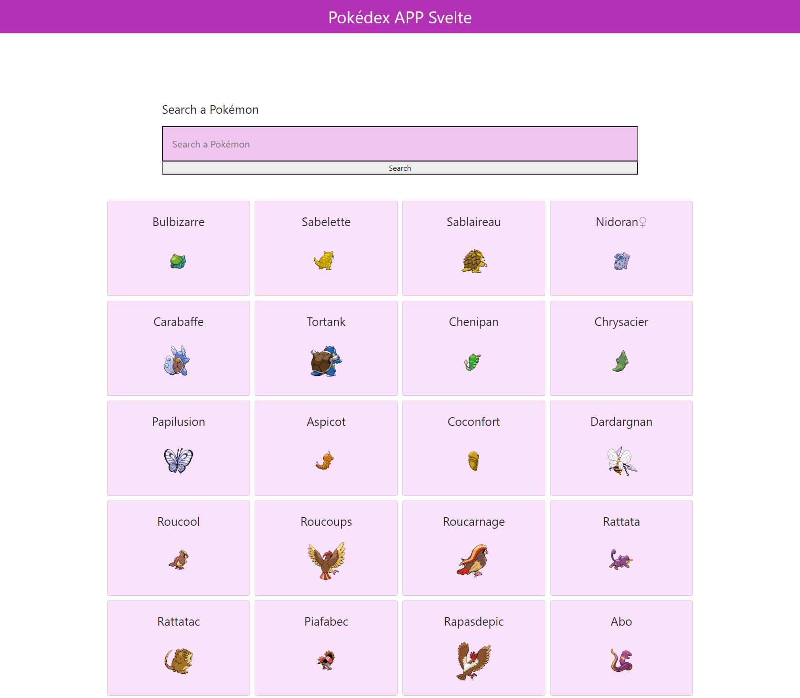
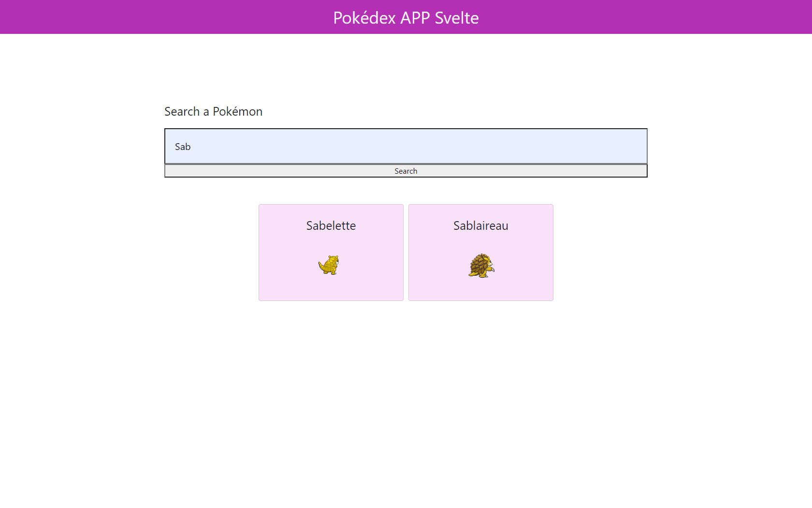

# Svelte.js - Pokédex

November 2020

> 🔨  Pokédex made with Svelte.
>
> From Udemy: [Svelte de A à Z](https://www.udemy.com/course/svelte-de-a-a-z/)

* * *

<h1 align="center">
    
</h1>

## About

Applcation that fetches a Pokémon API.

It displays Pokémons by name (in French) and display an image of the creature.

Tip: disable *autosave* when you work with api, otherwise it will make tons of not useful request.

## How to test

- Clone
- `npm install`
- `npm run dev`

## Useful links

- [Svelte.js](https://svelte.dev/)
- [Getting started with Svelte](https://developer.mozilla.org/en-US/docs/Learn/Tools_and_testing/Client-side_JavaScript_frameworks/Svelte_getting_started)
- [Svelte training sources](https://github.com/Ziratsu/SourceSvelte)
- [The RESTful Pokémon API](https://pokeapi.co/)
- [Page npm UUID](https://www.npmjs.com/package/uuid)
